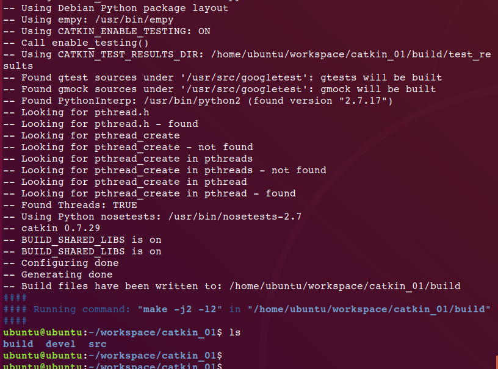
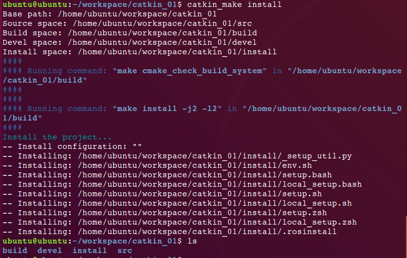
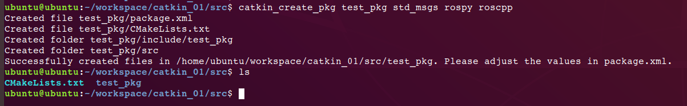

## 1、新建工作空间：
> 
	mkdir -p ~/workspace/catkin_01/src
	cd catkin_01/src
	初始化工作工作空间：catkin_init_workspace
	回到工作空间根目录: cd ..
	编译： catkin_make

执行ls后可以看到除了src还多了两个文件夹：build 和 devel

>
	设置环境变量： source devel/setup.sh 

	
注：每次使用工作空间都需要执行，或者手动设置换机变量，就不需要每次都执行
		vim ~/.bashrc
		在最后一行添加 source xx/workspace/catkin_01/devel/setup.sh，其中xx为工作空间目录
工作空间还需要install文件夹，需要用编译指令生成，即执行：
>
	catkin_make install

## 2、创建功能包
>
	cd ~/workspace/catkin_01/src
	创建功能包test_pack：
		catkin_create_pkg test_pkg std_msgs rospy roscpp

>
	

此时也可以到工作空间根目录下编译

	cd ~/workspace/catkin_01
	catkin_make

完。

