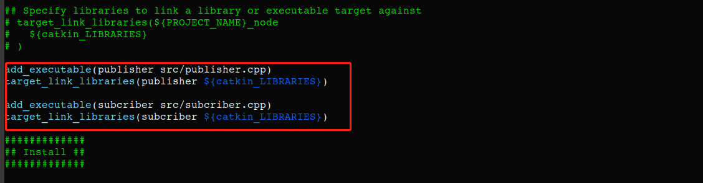
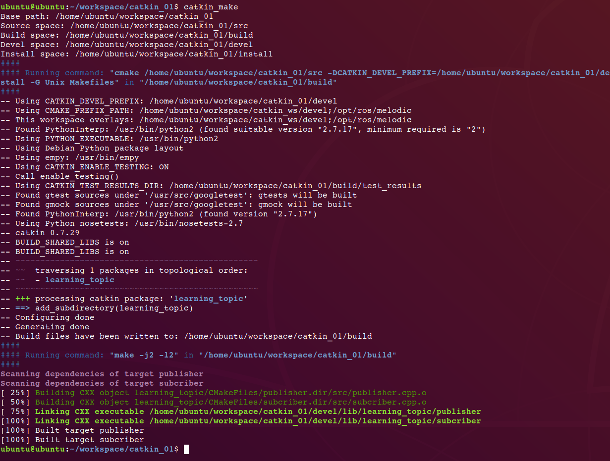
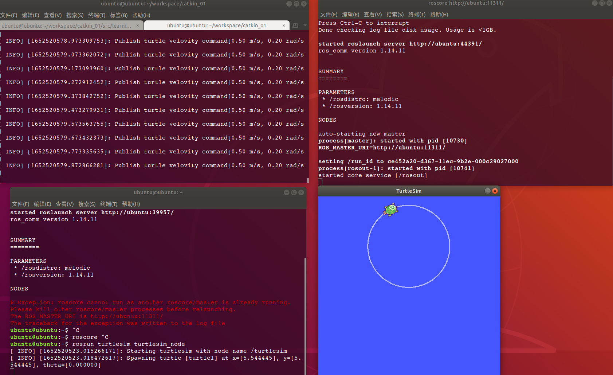
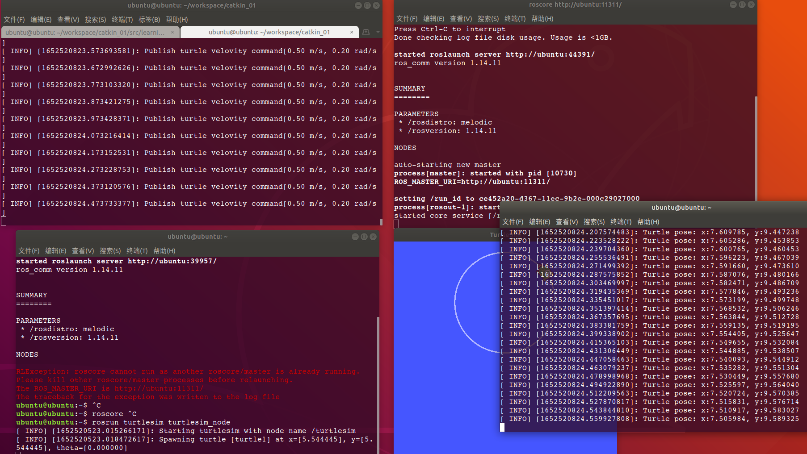

# publisher节点发送消息给turtlesim包的turtlesim\_node节点 （小乌龟），再用subscriber节点接收turtlesim_node发出来的消息
---
## 1、创建功能包
	cd ~/workspace/catkin_01/src	
	catkin_create_pkg learning_topic roscpp rospy std_msgs geometry_msgs turtlesim

## 2、创建源文件
    cd learning_topic/src
 新建publisher.cpp 和 subscriber.cpp

publisher.cpp：

	#include <ros/ros.h>
	#include <geometry_msgs/Twist.h>	
	int main(int argc, char *argv[])
	{
	// ros node init
	ros::init(argc, argv, "Publisher");
	
	// create handle
	ros::NodeHandle n;
	
	ros::Publisher trutle_vel_pub = n.advertise<geometry_msgs::Twist>("/turtle1/cmd_vel", 10);
	
	ros::Rate loop_rate(10);
	
	int count = 0;
	
	   while (ros::ok()) {
	   geometry_msgs::Twist vel_msg;
	   vel_msg.linear.x = 0.5;
	   vel_msg.angular.z = 0.2;
	
	   trutle_vel_pub.publish(vel_msg);
	   ROS_INFO("Publish turtle velovity command[%0.2f m/s, %0.2f rad/s]", vel_msg.linear.x, vel_msg.angular.z);
	
	   loop_rate.sleep();
	   }
	
	return 0;
	}

subcriber.cpp ：

	#include <ros/ros.h>
	#include <turtlesim/Pose.h>	
	void poseBack(const turtlesim::Pose::ConstPtr& msg)
	{
	    ROS_INFO("Turtle pose: x:%0.6f, y:%0.6f", msg->x, msg->y);
	}
	
	int main(int argc , char *argv[])
	{
	    ros::init(argc, argv, "pose_subscriber");
	
	    ros::NodeHandle n;
	
	    ros::Subscriber pose_sub = n.subscribe("/turtle1/pose", 10, poseBack);
	
	    ros::spin();
	    
	    return 0;
	}

## 3、声明可执行文件、指定链接库

执行：
>
	vim ~/workspace/catkin_01/src/learning_topic/CMakeLists.txt

添加

	add_executable(publisher src/publisher.cpp)
	target_link_libraries(publisher ${catkin_LIBRARIES})
	
	add_executable(subcriber src/subcriber.cpp)
	target_link_libraries(subcriber ${catkin_LIBRARIES})

保存后退出。

## 4、编译

进入工作空间根目录
	
	cd ~/workspace/catkin_01/
	catkin_make

## 5、运行节点

执行：
	
	rosrun learning_topic publisher 

打开新的终端执行：
	
	roscore

打开新的终端执行：
	
	rosrun turtlesim turtlesim_node

此时可以看到小乌龟正在移动，表示turtlesim_node节点成功接收到publisher节点发出的消息
	

再打开一个新的终端执行：
	
	rosrun learning_topic subcriber

可以看到subscriber节点超过接收到了消息

