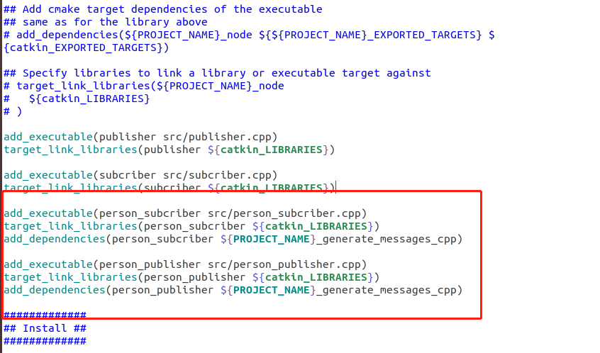

# 自定义消息 #
## 1、创建.msg文件 ##
	
	cd ~/workspace/catkin_01/src/learning_topic
	mkdir msg
	cd msg
	vim Person.msg

复制以下内容到Person.mag文件内

	string name
	uint8 sex
	uint8 age
	
	uint8 unknow = 0
	uint8 male   = 1
	uint8 female = 2

保存退出。

## 2、设置编译规则 ##
	
	gedit ~/workspace/catkin_01/src/learning_topic/package.xml

复制如下内容到xml文件内

	<build_depend>message_generation</build_depend>
  	<exec_depend>message_runtime</exec_depend>

保存退出。

----------
执行

	gedit ~/workspace/catkin_01/src/learning_topic/CMakeLists.txt
	
在 find\_package 中添加 message_generation，如图：

保存退出。

----------

在如下位置添加

	add_message_files(FILES Person.msg)
	generate_messages(DEPENDENCIES std_msgs)

保存退出。

----------

将`catkin_package`第三行的注释内容放开，并在末尾添加`message_runtime`，**注意与前面的package有一个空格间隔开**

保存退出。

## 3、编译 ##

回到工作空间更目录执行编译命令(可以打开新的终端)

	cd ~/workspace/catkin_01
	catkin_make

生成的消息头文件Person.h放在工作空间根目录 -> devel -> include  -> learning_topic

到此，消息就定义好了。下面介绍怎么去使用这个消息。

----------

# 创建 publisher 和 subcriber #

## 1、新建publisher ##

进入节点的src目录
	cd  ~/workspace/catkin_01/src/learning_topic/src

新建 `person_publisher.cpp`，复制下面的代码到该文件内

    #include <ros/ros.h>
	#include "learning_topic/Person.h"
	
	int main(int argc, char *argv[])
	{
	    // ros节点初始化
	    ros::init(argc, argv, "person_publisher");
	
	    // 创建节点句柄
	    ros::NodeHandle n;

	    // 创建一个Publisher，发布名为 /person_qz 的topic，，消息类型为learning_topic::Person，队列长度为10
	    ros::Publisher person_info_pub = n.advertise<learning_topic::Person>("/person_qz", 10);
	
	    // 设置循环的频率（Hz）
	    ros::Rate loop_rate(10);
	
	    while (ros::ok()) {
	        // 初始化 learning_topic::Person 类型的消息
	        learning_topic::Person person_msg;
	        person_msg.name = "Tom";
	        person_msg.age = 19;
	        person_msg.sex = learning_topic::Person::male;
	
		// 发布消息
	        person_info_pub.publish(person_msg);
	        ROS_INFO("Publish Person info :  name:%s age:%d sex:%d", 
	                person_msg.name.c_str(), person_msg.age, person_msg.sex);
	        
		// 按照循环频率延时
		loop_rate.sleep();
	   }
	
	    return 0;
	}

## 2、新建subcriber ##

新建 `person_subcriber.cpp`，复制下面的代码到该文件内
	
	#include <ros/ros.h>
	#include "learning_topic/Person.h"

	void personInfoCallback(const learning_topic::Person::ConstPtr& msg)
	{
	    ROS_INFO("Person info: name:%s, age:%d, sex:%d",
	            msg->name.c_str(), msg->age, msg->sex);
	}
	
	int main(int argc , char *argv[])
	{
	    // ROS 节点初始化
	    ros::init(argc, argv, "person_subscriber");
	
	    // 创建节点句柄
	    ros::NodeHandle n;
	
	    // 创建一个Subscriber，订阅名为 /person_qz 的topic，注册回调函数 personInfoCallback
	    ros::Subscriber pose_sub = n.subscribe("/person_qz", 10, personInfoCallback);
	
	    // 循环等待回调函数
	    ros::spin();
 
	    return 0;
	}

----------
## 3、声明可执行文件、指定链接库和依赖项 ##

修改节点的`CMakeLists.txt`文件，执行

	gedit ~/workspace/catkin_01/src/learning_topic/CMakeLists.txt

将下面的内容添加到CmakeLists.txt文件内

	add_executable(person_subcriber src/person_subcriber.cpp)
	target_link_libraries(person_subcriber ${catkin_LIBRARIES})
	add_dependencies(person_subcriber ${PROJECT_NAME}_generate_messages_cpp)
	
	add_executable(person_publisher src/person_publisher.cpp)
	target_link_libraries(person_publisher ${catkin_LIBRARIES})
	add_dependencies(person_publisher ${PROJECT_NAME}_generate_messages_cpp)

## 4、编译 ##

工作空间更目录执行编译命令 `catkin_make`

## 5、运行节点 ##

使用三个终端，分别执行：

	roscore  // 必须第一个执行
	
	rosrun learning_topic person_publisher

	rosrun learning_topic person_subcriber

若出现not found，添加环境变量source xx/workspace/catkin_01/devel/setup.bash，其中xx为工作空间目录

不出意外，数据就会正常发送和接收了， 如下图

